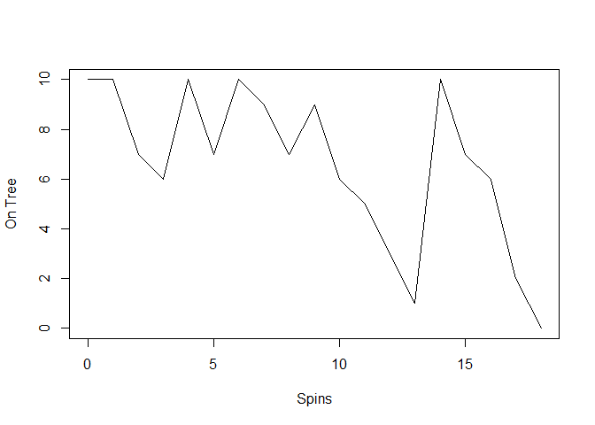

<!-- README.md is generated from README.Rmd. Please edit that file -->

# cherryr

<!-- badges: start -->

[](https://github.com/Brandonwood44/cherryr/actions/workflows/R-CMD-check.yaml)
<!-- badges: end -->

The goal of cherryr is to play the hit childrens game hi ho cherryo by
yourself. It also allows you to see how many turns it takes to finish
the game with differing numbers of starting cherries on the tree.

## Installation

You can install the development version of cherryr from
[GitHub](https://github.com/) with:

``` r
# install.packages("pak")
pak::pak("Brandonwood44/cherryr")
```

## Example

This is a basic example which shows you how to solve a common problem:

``` r
library(cherryr)
x <- play_game(10)
```

What is special about using `README.Rmd` instead of just `README.md`?
You can include R chunks like so:

``` r
summary(x)
#>    Min. 1st Qu.  Median    Mean 3rd Qu.    Max. 
#>      18      18      18      18      18      18
```

You’ll still need to render `README.Rmd` regularly, to keep `README.md`
up-to-date. `devtools::build_readme()` is handy for this.

You can also embed plots, for example:



In that case, don’t forget to commit and push the resulting figure
files, so they display on GitHub and CRAN.
